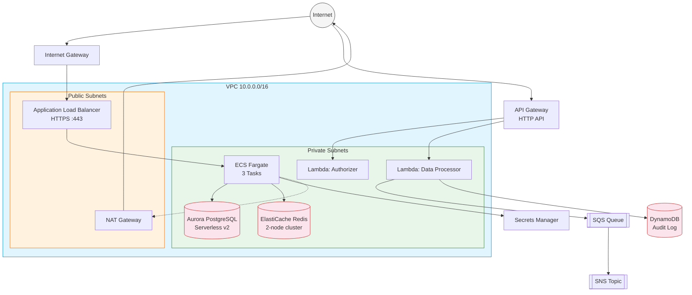
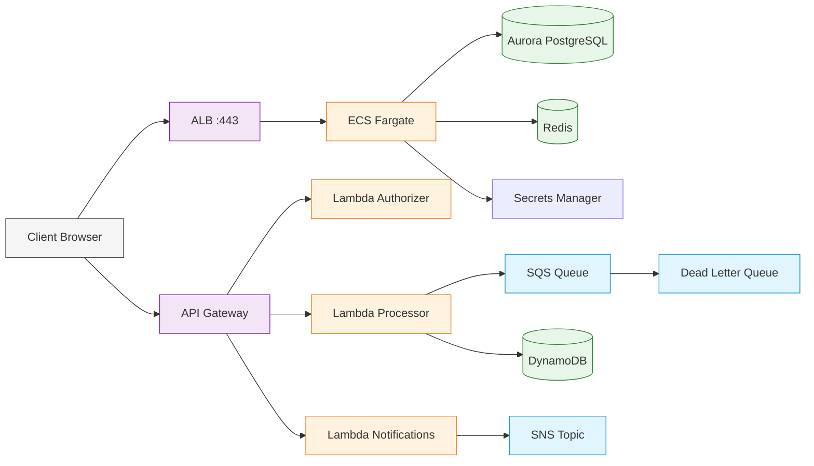
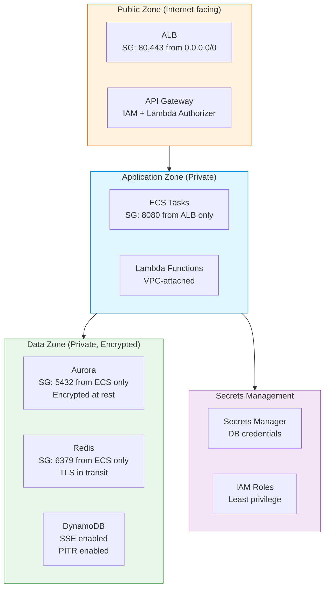

# Infrastructure Architecture

> Auto-generated from Terraform and CloudFormation definitions.
> AI analysis powered by Amazon Bedrock (Claude).
>
> Last generated: 2026-05-05T19:05:40.026Z

## Overview

This infrastructure deploys a **3-tier web application** on AWS:

- **Frontend**: Application Load Balancer with HTTPS termination (TLS 1.3)
- **Application**: ECS Fargate cluster running 3 tasks behind the ALB
- **Data**: Aurora PostgreSQL Serverless v2 (encrypted) + ElastiCache Redis
- **APIs**: API Gateway HTTP API with Lambda backends (authorizer, data processor, notifications)
- **Async**: SQS queue with DLQ for background processing, SNS for notifications
- **Audit**: DynamoDB table with point-in-time recovery for audit logging

The architecture follows AWS Well-Architected principles with multi-AZ deployment, encryption at rest and in transit, and least-privilege IAM roles.

## Risk Assessment

- 🟡 **MEDIUM**: ALB security group allows inbound from 0.0.0.0/0 on port 80 — consider redirecting HTTP to HTTPS and restricting to CloudFront IPs if using a CDN.
- 🟢 **LOW**: ECS task definition uses :latest tag — pin to a specific image digest for reproducible deployments.
- 🟢 **LOW**: RDS deletion_protection is enabled (good), but no automated backup window is explicitly configured.
- 🟢 **INFO**: ElastiCache transit encryption is enabled — ensure application clients support TLS connections.

## Network Topology

## Service Dependencies

## Security Zones

## Resource Inventory

### Terraform Resources

| Category | Resource Type | Name |
|----------|--------------|------|
| networking | `aws_vpc` | main |
| networking | `aws_subnet` | public_a |
| networking | `aws_subnet` | public_b |
| networking | `aws_subnet` | private_a |
| networking | `aws_subnet` | private_b |
| networking | `aws_internet_gateway` | igw |
| networking | `aws_nat_gateway` | nat |
| networking | `aws_eip` | nat |
| security | `aws_security_group` | alb_sg |
| security | `aws_security_group` | ecs_sg |
| security | `aws_security_group` | rds_sg |
| security | `aws_security_group` | redis_sg |
| load_balancing | `aws_lb` | app |
| load_balancing | `aws_lb_target_group` | app |
| load_balancing | `aws_lb_listener` | https |
| compute | `aws_ecs_cluster` | main |
| compute | `aws_ecs_task_definition` | app |
| compute | `aws_ecs_service` | app |
| database | `aws_rds_cluster` | main |
| database | `aws_rds_cluster_instance` | main |
| networking | `aws_db_subnet_group` | main |
| other | `random_password` | db |
| secrets | `aws_secretsmanager_secret` | db_password |
| secrets | `aws_secretsmanager_secret_version` | db_password |
| cache | `aws_elasticache_replication_group` | main |
| networking | `aws_elasticache_subnet_group` | main |
| iam | `aws_iam_role` | ecs_execution |
| iam | `aws_iam_role` | ecs_task |

### CloudFormation Resources

| Category | Resource Type | Logical ID |
|----------|--------------|------------|
| api | `AWS::ApiGatewayV2::Api` | ApiGateway |
| api | `AWS::ApiGatewayV2::Stage` | ApiStage |
| compute | `AWS::Lambda::Function` | AuthorizerFunction |
| compute | `AWS::Lambda::Function` | DataProcessorFunction |
| compute | `AWS::Lambda::Function` | NotificationFunction |
| messaging | `AWS::SQS::Queue` | ProcessingQueue |
| messaging | `AWS::SQS::Queue` | DeadLetterQueue |
| messaging | `AWS::SNS::Topic` | NotificationTopic |
| database | `AWS::DynamoDB::Table` | AuditTable |
| security | `AWS::EC2::SecurityGroup` | LambdaSecurityGroup |
| iam | `AWS::IAM::Role` | LambdaExecutionRole |
| monitoring | `AWS::Logs::LogGroup` | ApiLogGroup |
